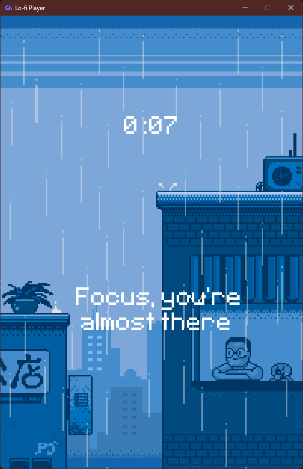
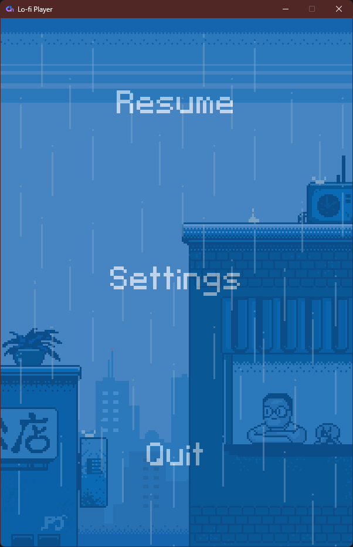
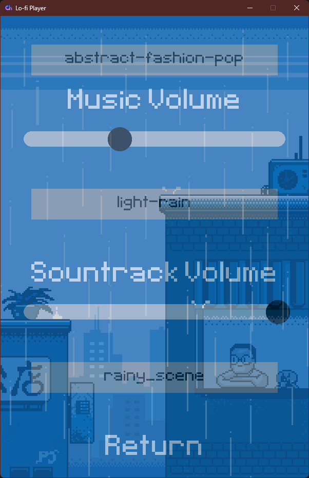
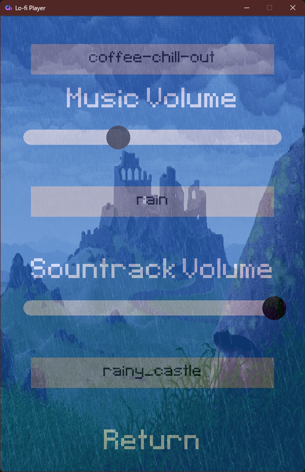

<h1 align="center">
  <br>
  <!--- cspell:disable-next-line --->
  
  <br>
  Pomodoro-Life
  <br>
</h1>

<h4 align="center">A Lo-Fi music player with rain sound effects in the background. Includes a basic <a href="https://en.wikipedia.org/wiki/Pomodoro_Technique" target="_blank">Pomodoro timer</a>. Very modular.</h4>

<!-- Horizontal short Menu (w\ Links) -->
<p align="center">
  <a href="#key-features">Key Features</a> •
  <a href="#gallery">Gallery</a> •
  <a href="#how-to-use">How To Use</a> •
  <a href="#retrospective">Context</a> •
  <a href="#retrospective">Retrospective</a> •
  <a href="#credits">Credits</a>
</p>

<!-- Animated Screenshot-->
<div align=center>

</div>

## Key Features

- Customizable Pomodoro timer
- Simple and distraction-free
- Lightweight and portable
- Add your own **Music**, **Rain Soundtrack**, and **Backgrounds**

## Gallery

<div align=center>




</div>

> **Note**
> There are also 2 videos available in `/readme-media` which I failed to embed. A 1-minute demo and the video version of the gif at the top of this page (with sound).

## How To Use

### Installation

To run this software, you will need to have [Python](https://www.python.org/) installed on your computer. From your command line run:

```bash
# Clone this repository
$ git clone

# Navigate inside the folder
$ cd pomodoro-lofi

# Install dependencies
$ pip install -r requirements.txt

# Run the app
$ python .\main.py
```

> **Note**
> For MacOS and Linux you might need to use `python3` or `py` instead of `python`

> **Note 2**
> If you know how, I highly recommend creating a [virtual environment](https://docs.python.org/3/library/venv.html) before installing the required packages

### Using the app

- Tapping `Esc` or **right-clicking** with a mouse will bring you to the **Pause Menu**, doing this will pause the Timer.
- Here you can select **Settings** to edit them or return by tapping `Esc` or **right-clicking**.
- In Settings, you can choose your **Rain Soundtrack**, **Music** and adjust the **Volume** of each independently.
- Once you are done, you can return to the **Pause Menu** and from there to the main screen.
- On the main screen, you will see a timer going up every second.
- By **left-clicking** it you will be able to type in an amount of time to **set your timer**.
- The input most be formatted as `00:00:00` as hours : minutes : seconds. Providing just a number `00` or two `00:00` will result in adding only seconds or minutes and seconds, respectively.
- All numbers will be counted. If you input `01:70:70` the timer will be `02:11:10`. Have fun with that; I know I did :P
- When the **timer ends**, the **message will change** and a new timer will start, which you can also edit the same way.
- These are the **Focus Timer** and **Break Timer**; they come from the Pomodoro technique. Their defaults are 25 min and 5 min, respectively.
- Your **settings will be saved** and automatically loaded. This includes _volume_, _soundtrack_, _music_, _background_, and _timer length_.

### Adding your own backgrounds (animated or not), music and soundtracks:

- **Music** - Add it to the `audio/music` folder; it must be an `.mp3` file and have no `.` in the name.
- **Soundtrack** - Add it to the `audio/soundtrack` folder, it must also be a `.mp3` file and also have no `.` in the name.
- **Backgrounds** - Since I wanted to have animated backgrounds, this one is a bit more complicated. First, create a folder with the name of your background in `graphics/backgrounds`. E.g. `graphics/backgrounds/night_sky` (it can contain spaces, I simply prefer them like this). Then inside you must have all the frames of your Bg. If it's a static image, simply name it `frame_0.gif`, yes it must be a `.gif` format. If you have more frames, name them `frame_1.gif`, `frame_2.gif`, etc. As many as you want. If you use an online tool like [this one](https://ezgif.com/split) you can easily **split your gifs into frames**, convert them, resize them and more.

## Retrospective

This was my first real pygame project. I had spent a day following a 3-4 hour game tutorial previously, but this is the first time I went completely on my own, read documentation and tried out whatever I wanted.

The original idea was extremely simple and could not even be considered a game. I wanted to simulate thunder on a rainy day when the user clicked the screen. However, since that seemed very lacking, I started by adding ambience, menus and a bunch of other stuff while hoping I could add something to it. Yes, I know I could have gone with a cliché game, but I just could not get the thunder effect out of my head; it calls out to me... I must implement it! ...but somehow I ended up with a lo-fi music player instead XD.

I also gave myself a one-week time limit to limit the scope and effort I invest in this project. I ended up stopping earlier, but that was because I ran out of features to implement, as well as steam. Besides, I believe the App is great as it is. I could polish it, but then I would never be finished, and I would rather work on something else than ruin what I have right now. As for the Thunder idea, as much as I would love to add it, it feels like it would ruin the current app. This app is good enough for now; I learned a lot more than I expected, and I would rather move on to a new project where I can _finally_ implement **MIGHTY PROCEDURAL THUNDER**

Something that turned out surprisingly hard was the game development aspect of this project. As mentioned previously, this started off as a game idea, and so it incorporates certain traits of one through Pygame. Without a more developed framework to manage the basics, something like [Vite](https://vite.dev/), I had to keep everything in one loop, which is complicated and forces you into tough positions. I implemented some code in ways I wish were cleaner.

Also, python...python was a pain. The lack of types is great when you want to do something risky, not recommended or outside the norm, but before I discovered Type hints, it was a painful to find out methods and keep track of what objects are what types.

Thanks for reading this far. Be sure to check out the [Credits](#Credits) below for the amazing artists whose art made helped me keep going when I was losing motivation.

## Credits

This software uses the following open source packages:

- [Pygame](https://www.pygame.org/docs/)
- [Pygame Widgets](https://pygamewidgets.readthedocs.io/en/stable/)

And the following assets:

- Icon from <a href="https://icons8.com/icon/bGr7rgstoSns/chillhop-music">Icons8.com</a>
- Music from Pixibay:
  - Coffee Chill Out by <a href="https://pixabay.com/users/romanbelov-25347333/?utm_source=link-attribution&utm_medium=referral&utm_campaign=music&utm_content=15283">Roman Belov</a> from <a href="https://pixabay.com//?utm_source=link-attribution&utm_medium=referral&utm_campaign=music&utm_content=15283">Pixabay</a>
  - Abstract Fashion Pop by <a href="https://pixabay.com/users/qubesounds-24397640/?utm_source=link-attribution&utm_medium=referral&utm_campaign=music&utm_content=131283">Yurii Semchyshyn</a> from <a href="https://pixabay.com/music//?utm_source=link-attribution&utm_medium=referral&utm_campaign=music&utm_content=131283">Pixabay</a>
  - Order by <a href="https://pixabay.com/users/comastudio-26079283/?utm_source=link-attribution&utm_medium=referral&utm_campaign=music&utm_content=99518">Yurii Semchyshyn</a> from <a href="https://pixabay.com//?utm_source=link-attribution&utm_medium=referral&utm_campaign=music&utm_content=99518">Pixabay</a>
- Background Art:
  - Rainy Day by <a href="https://www.deviantart.com/pixeljeff/art/Rainy-Day-640373144">pixeljeff</a>
  - Rainy Castle by <a href="https://steamcommunity.com/sharedfiles/filedetails/?id=803160112">Nathan</a>
- Rain Sountracks from Pixibay:
  - Light Rain by <a href="https://pixabay.com/users/liecio-3298866/?utm_source=link-attribution&utm_medium=referral&utm_campaign=music&utm_content=109591">LIECIO</a> from <a href="https://pixabay.com/sound-effects//?utm_source=link-attribution&utm_medium=referral&utm_campaign=music&utm_content=109591">Pixabay</a>
  - Rain by <a href="https://pixabay.com/users/donrain-26735743/?utm_source=link-attribution&utm_medium=referral&utm_campaign=music&utm_content=110508">Franco Gonzalez</a> from <a href="https://pixabay.com//?utm_source=link-attribution&utm_medium=referral&utm_campaign=music&utm_content=110508">Pixabay</a>
  - Rain on the window by <a href="https://pixabay.com/users/donrain-26735743/?utm_source=link-attribution&utm_medium=referral&utm_campaign=music&utm_content=114709">Franco Gonzalez</a> from <a href="https://pixabay.com/sound-effects//?utm_source=link-attribution&utm_medium=referral&utm_campaign=music&utm_content=114709">Pixabay</a>
  - Indoor Hard Rain by <a href="https://pixabay.com/users/u_m17uwtnjmh-42333415/?utm_source=link-attribution&utm_medium=referral&utm_campaign=music&utm_content=190883">u_m17uwtnjmh</a> from <a href="https://pixabay.com/sound-effects//?utm_source=link-attribution&utm_medium=referral&utm_campaign=music&utm_content=190883">Pixabay</a>
  - Rain Sound by <a href="https://pixabay.com/users/avion_mood-39857343/?utm_source=link-attribution&utm_medium=referral&utm_campaign=music&utm_content=188158">Vladislav Kim</a> from <a href="https://pixabay.com/sound-effects//?utm_source=link-attribution&utm_medium=referral&utm_campaign=music&utm_content=188158">Pixabay</a>

### My Links

> [neo-dev.org](https://neo-dev.org) &nbsp;&middot;&nbsp;
> GitHub [@N4fta](https://github.com/N4fta)
